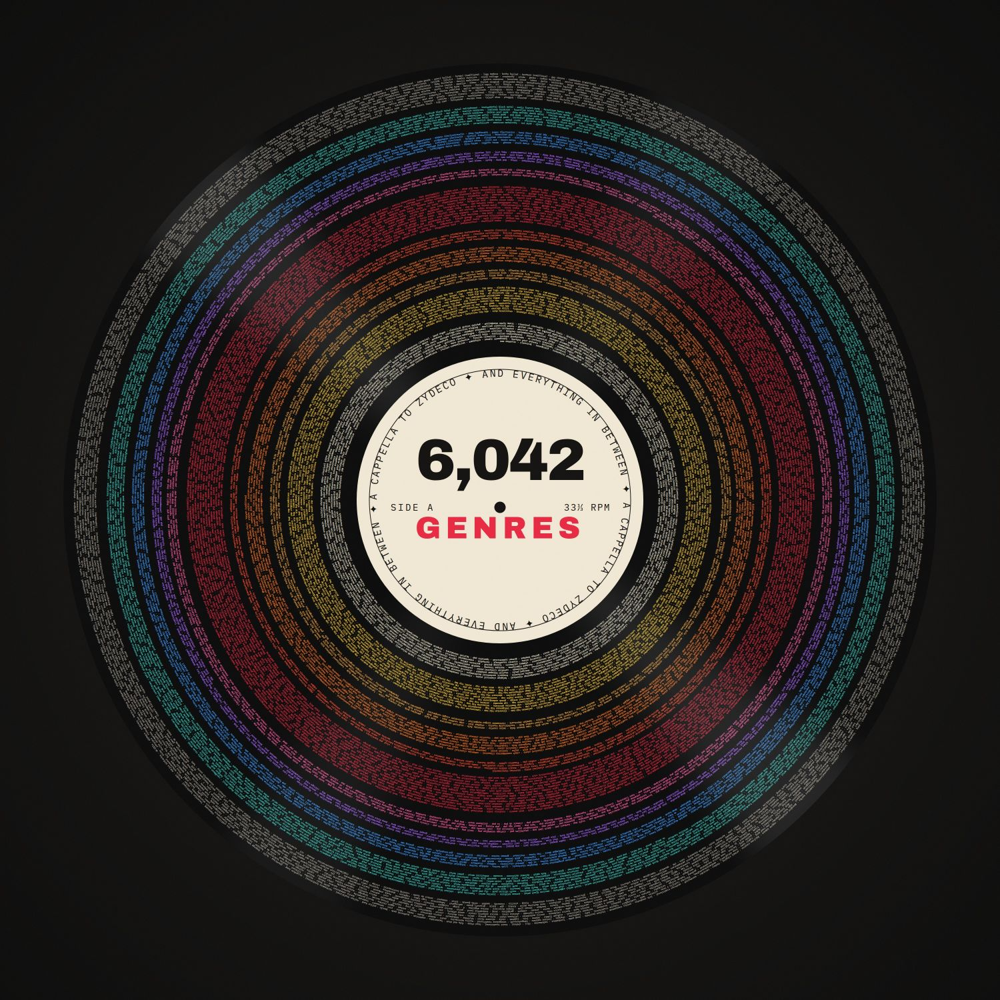

# The Sound of Everything (Updated Weekly)

**A living playlist with one song for every genre of music — thousands of them — that refreshes itself every week.**

  

▶ **Listen:** https://open.spotify.com/playlist/3yn8CQlQ3Q903K0LsoSkPY

## What it is

Somewhere out there is a genre called *escape room*, another called *deep house*,
another called *bluegrass* — and thousands more. This playlist holds one
representative song from **every** one of them, so you can wander from corner to
corner of the musical map in a single sitting.

And it looks after itself. Once a week it quietly swaps in fresh songs and picks
up any newly discovered genres, so it never goes stale.

## Why it exists

For years, [*The Sound of Everything*](https://open.spotify.com/playlist/69fEt9DN5r4JQATi52sRtq)
— created by Glenn McDonald alongside his remarkable
[Every Noise at Once](https://everynoise.com) project — was the definitive "map
of all music": a single song for each of the ~6,000 genres Spotify tracks. Then
McDonald left Spotify in late 2023, and the playlist froze in place.

This project keeps that idea alive — a fresh, self-updating version living on a
personal Spotify profile, rebuilt from the same public genre data.

## How songs get chosen

Good question — here's the whole process in plain terms:

- **The genres come first.** It reads the full list of ~6,300 genres from Every
  Noise at Once — everything from *bluegrass* to *escape room*.
- **One song per genre, via Spotify search.** For each genre it searches Spotify
  and picks a representative track. It also makes sure **no song is used twice**,
  so every genre gets its own unique pick.
- **It refreshes on a rotation.** Once a week an automated job revisits the
  genres it hasn't touched in the longest, and re-picks a **different** song for
  each — so the playlist keeps evolving instead of going stale. Over successive
  weeks the whole list cycles through, then starts again.
- **New genres get added automatically.** When Every Noise at Once lists a new
  genre, it's seeded right away and folded into the rotation.

One honest caveat: Spotify retired the richer music-data tools that powered the
original (things like "this artist's top track" and popularity rankings), so this
version leans on plain search. That means most picks are spot-on and a few are
"eh" — if you spot a weak one, say so and it gets fixed.

## Want to run your own?

Everything you need is in **[SETUP.md](SETUP.md)** — creating a free Spotify app,
connecting your account, and switching on the weekly auto-refresh. About 15
minutes, start to finish.

---

*Not affiliated with Spotify, The Sounds of Spotify, or Every Noise at Once.
Genre data comes from the public everynoise.com pages; this is a fan project.*
